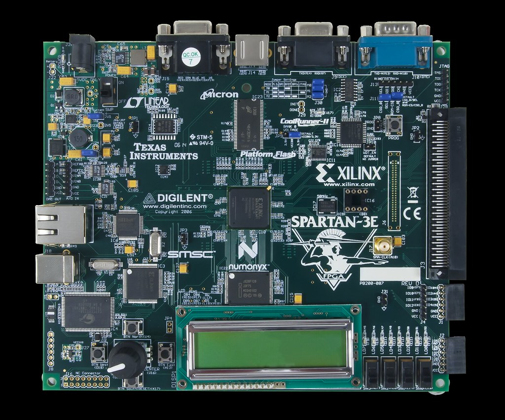

# Spartan-3E Starter Kit Demo



LED blinker demo for the Xilinx Spartan-3E Starter Kit (XC3S500E-FG320-4).

## Board Specifications

| Feature | Details |
|---------|---------|
| FPGA | Xilinx XC3S500E (10,000 logic cells, 320-pin FBGA) |
| Clock | 50 MHz on-board oscillator + aux DIP socket + SMA input |
| DDR SDRAM | 64 MB (512 Mbit), Micron MT46V32M16, x16, 100+ MHz |
| Parallel NOR Flash | 16 MB (128 Mbit), Intel StrataFlash |
| SPI Serial Flash | 2 MB (16 Mbit), STMicro M25P16 |
| Platform Flash | 4 Mbit Xilinx XCF04S (FPGA config storage) |
| CPLD | Xilinx XC2C64A CoolRunner-II (64 macrocells) |
| Character LCD | 2×16 characters, 4-bit interface |
| VGA | DB15, 3-bit color (8 colors), 640×480 @ 60 Hz |
| RS-232 | 2 ports — DCE (female DB9) + DTE (male DB9) |
| PS/2 | Mouse/keyboard port (6-pin mini-DIN) |
| Ethernet | 10/100 PHY (SMSC LAN83C185) + RJ-45 |
| DAC | 4-channel, 12-bit, SPI (Linear Tech LTC2624) |
| ADC | 2-channel, 14-bit simultaneous, SPI (Linear Tech LTC1407A-1) |
| Pre-Amplifier | Dual programmable gain (LTC6912-1), gains -1 to -100 |
| LEDs | 8 discrete, active-high |
| Slide Switches | 4 |
| Push Buttons | 4 (N/E/S/W) |
| Rotary Encoder | Shaft encoder + push button |
| Expansion | Hirose FX2 100-pin (43 I/O) + three 6-pin headers |
| 1-Wire EEPROM | Maxim DS2432 SHA-1 (bitstream copy protection) |
| USB-JTAG | On-board programming/debug (Type B connector) |

## Requirements

- Xilinx ISE 14.7 (WebPack edition, free license)
- xc3sprog (JTAG programmer)
- Linux / WSL

## Installing ISE 14.7 on WSL (Ubuntu 24.04)

Ubuntu 24.04 dropped some libraries ISE depends on. Install prerequisites first:

```bash
sudo dpkg --add-architecture i386
sudo apt update
sudo apt install -y lib32ncurses6 lib32tinfo6 libstdc++6:i386 lib32z1

# Create compat symlinks (ISE expects libncurses5)
sudo ln -sf /usr/lib32/libncurses.so.6 /usr/lib32/libncurses.so.5
sudo ln -sf /usr/lib32/libtinfo.so.6 /usr/lib32/libtinfo.so.5
sudo ln -sf /usr/lib/x86_64-linux-gnu/libncurses.so.6 /usr/lib/x86_64-linux-gnu/libncurses.so.5
sudo ln -sf /usr/lib/x86_64-linux-gnu/libtinfo.so.6 /usr/lib/x86_64-linux-gnu/libtinfo.so.5
```

Add to your `~/.bashrc` (ISE crashes without these):

```bash
ulimit -s unlimited
export LC_ALL=C
```

Then run the batch installer (download `Xilinx_ISE_DS_Lin_14.7_1015_1.tar` from Xilinx/AMD):

```bash
tar xf Xilinx_ISE_DS_Lin_14.7_1015_1.tar
cd Xilinx_ISE_DS_Lin_14.7_1015_1
sudo ./bin/lin64/batchxsetup --batch /path/to/ise_install.cfg
```

See `ise_install.cfg` in this repo for the config used.

## Installing xc3sprog

```bash
sudo apt install -y xc3sprog
```

iMPACT does not work reliably on WSL due to libusb/driver issues. Use xc3sprog instead.

## Setup

Source the ISE environment before building:

```bash
source /opt/Xilinx/14.7/ISE_DS/settings64.sh
```

## Build

```bash
make        # synthesize → bitstream
make clean  # remove build artifacts
```

## USB passthrough (WSL)

The board connects to Windows via USB. To make it visible in WSL, use `usbipd` from an **Admin PowerShell**.

Find the Xilinx cable's bus ID:

```powershell
usbipd list
```

Look for `03fd:0008` (firmware loaded) or `03fd:000d` (firmware not loaded). Then bind and attach:

```powershell
usbipd bind --busid <BUSID>
usbipd attach --wsl --busid <BUSID>
```

Verify in WSL:

```bash
lsusb | grep Xilinx
```

Note: re-attach is needed after each reconnect or reboot.

### Firmware loading

If the cable shows `03fd:000d` (firmware not loaded) instead of `03fd:0008`, load the firmware manually:

```bash
sudo fxload -t fx2 -I /opt/Xilinx/14.7/ISE_DS/ISE/bin/lin64/xusbdfwu.hex -D /dev/bus/usb/<bus>/<dev>
```

The cable re-enumerates after firmware load — re-attach from PowerShell before continuing.

## Program the board

Connect the board via USB-JTAG (see above), then:

```bash
sudo xc3sprog -c xpc -p 0 build/top.bit
```

## Design

- `src/top.vhd` — 32-bit counter, upper bits drive 8 LEDs at visible rates
- `constraints/top.ucf` — pin assignments for 50 MHz clock and LEDs
- `build/top.xst` — XST synthesis script
- `build/top.prj` — XST project file
